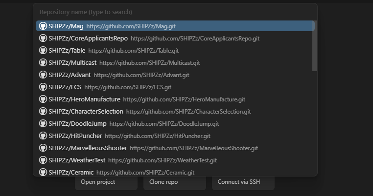
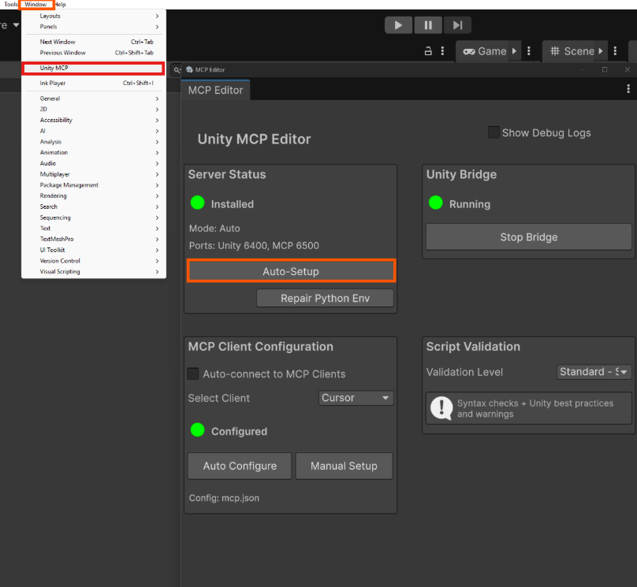

# Cursor AI - Установка и настройка

## Скачивание и установка

**Сайт для скачивания:** [https://cursor.com/downloads](https://cursor.com/downloads)

1. Перейдите на сайт
2. Нажмите "Download" 
3. Скачайте версию для вашей ОС
4. Установите как обычную программу

## Открытие проекта

### Через файловую систему
1. Запустите Cursor
2. `File` → `Open Folder` (или `Ctrl+O`)
3. Выберите папку с проектом


### Через Git
1. Авторизуйтесь через гит в Cursor в начальном экране
2. Выберите нужный репозиторий



## Настройка моделей AI

**Важно:** Для лучшей работы с AI рекомендуется выбирать качественные модели вместо режима Auto.

### Выбор моделей
1. Перейдите в настройки Cursor
2. Откройте вкладку "Models"
3. Включите необходимые модели


### Рекомендуемые модели
- **GPT-4** - отличное качество кода и понимание контекста
- **Claude 3.5 Sonnet** - быстрая и точная генерация кода
- **Grok** - хорошая альтернатива для различных задач

**Не рекомендуется:** Режим Auto может выбирать менее качественные модели.

## Установка MCP для Cursor

**GitHub репозиторий:** [https://github.com/CoplayDev/unity-mcp](https://github.com/CoplayDev/unity-mcp)

MCP (Model Context Protocol) позволяет Cursor работать с Unity проектами через специальный мост.

### Возможности с MCP:
- **Создание шейдеров и материалов** и применение их на объекты на сцене
- **Чтение логов всех видов** из консоли в Unity и исправление ошибок благодаря им
- **Создание объектов** по своему усмотрению (скейл, позиция, форма, размещение и т.д.)
- **Создание объектов вместе со скриптами**
- **Чтение сцены** и анализ структуры проекта
- **Вызов редакторных команд** Unity
- **Чтение/удаление/изменение префабов** и других ассетов

### Требования
- **Unity:** Version 2021.3 LTS или новее
- **Python:** [Скачать с python.org](https://www.python.org/downloads/)

### Установка

#### 1. Установка Python
1. Скачайте Python с [python.org](https://www.python.org/downloads/)
2. Установите с настройками по умолчанию

#### 2. Установка uv
Выполните в PowerShell:
```powershell
powershell -ExecutionPolicy ByPass -c "irm https://astral.sh/uv/install.ps1 | iex"
```
**Важно:** Запомните путь к файлу `uv.exe` - он понадобится позже.

#### 3. Установка Cursor MCP в Unity
1. Откройте Unity Package Manager
2. Нажмите "+" → "Add package from git URL"
3. Вставьте: `https://github.com/CoplayDev/unity-mcp.git?path=/UnityMcpBridge`


#### 4. Настройка MCP в Unity
1. Откройте MCP окно в Unity
2. Нажмите "AutoSetup" и "AutoConfigure"



#### 5. Настройка MCP в Cursor
1. Откройте настройки Cursor
2. Перейдите на вкладку "MCP"
3. Проверьте, что MCP установлен (зеленый индикатор и количество tools ~18)


#### 6. Ручная настройка (если автоматическая не сработала)
1. В Unity MCP Window выберите "Manual Setup"
2. Откройте JSON файл
3. Замените путь до `uv.exe` на правильный


4. Нажмите "Auto-Setup", "Auto Configure" и "Repair Python Env"
5. Перезапустите Unity и Cursor

#### 7. Проверка работы
В Cursor введите промпт: `"read console logs by using mcp"`


#### 8. Отключение запрашивания разрешений
Для удобной работы с MCP рекомендуется отключить запрашивание разрешений:
1. Перейдите в Settings → Chat
2. Найдите "Auto Run Mode"
3. Установите "Run Everything"


## Как использовать Cursor

### Основные принципы работы

#### 1. Планирование сложных задач
При работе со сложными и большими задачами:

1. **Составьте план с Cursor:**
   - Опишите общую задачу
   - Попросите Cursor разбить её на этапы
   - Обсудите последовательность выполнения

2. **Разбейте задачу на фазы:**
   - Каждый этап должен быть конкретным и выполнимым
   - Определите зависимости между этапами
   - Установите приоритеты

3. **Уточняющие вопросы:**
   - Перед каждым этапом спросите: "Есть ли у тебя уточняющие вопросы?"
   - Предоставьте дополнительную информацию
   - Уточните требования и ограничения

#### 2. Проверка результатов
**Важно:** После каждого промпта обязательно проверяйте:
- Корректность написанного кода
- Соответствие требованиям
- Отсутствие ошибок
- Работоспособность решения

### Примеры эффективных промптов

#### Для Unity разработки:
```
"Создай систему управления игроком с возможностью движения, прыжков и анимации. 
Сначала составь план, затем разбей на этапы."
```

#### Для отладки:
```
"Проанализируй ошибки в консоли Unity и предложи решения. 
Есть ли у тебя вопросы по коду?"
```

#### Для рефакторинга:
```
"Оптимизируй этот скрипт для лучшей производительности. 
Какие аспекты нужно улучшить в первую очередь?"
```

### Лучшие практики

1. **Будьте конкретными** - описывайте детали задачи
2. **Задавайте контекст** - объясняйте цель и ограничения
3. **Используйте итеративный подход** - работайте по этапам
4. **Всегда проверяйте результат** - не полагайтесь слепо на AI
5. **Задавайте уточняющие вопросы** - это улучшает качество ответов

## Настройка интерфейса под Rider

Cursor можно настроить в точности как JetBrains Rider:

**Сайт с документацией:** [https://docs.cursor.com/ru/guides/migration/jetbrains#сочетания-клавиш](https://docs.cursor.com/ru/guides/migration/jetbrains#сочетания-клавиш)

### 1. Установка расширений
- **IntelliJ IDEA Keybindings** - горячие клавиши как в Rider
- **JetBrains IDE Theme** - цветовая схема Rider
- **ReSharper** - анализ кода как в Rider
- **C#** - поддержка C#

### 2. Настройка темы
1. `Ctrl+Shift+P` → "Preferences: Color Theme"
2. Выберите "JetBrains IDE Theme" или "IntelliJ IDEA"
3. Или установите "Material Theme" с настройками под Rider

### 3. Горячие клавиши как в Rider
1. `Ctrl+Shift+P` → "Preferences: Open Keyboard Shortcuts"
2. Нажмите на иконку "Open Keyboard Shortcuts (JSON)"
3. Добавьте настройки:

```json
[
    {
        "key": "ctrl+shift+f10",
        "command": "workbench.action.debug.start"
    },
    {
        "key": "ctrl+f5",
        "command": "workbench.action.debug.run"
    },
    {
        "key": "ctrl+shift+f9",
        "command": "workbench.action.debug.stop"
    },
    {
        "key": "ctrl+alt+l",
        "command": "editor.action.formatDocument"
    },
    {
        "key": "ctrl+alt+o",
        "command": "editor.action.organizeImports"
    }
]
```

### 4. Настройка анализа кода (ReSharper)
1. Установите расширение "ReSharper"
2. `Ctrl+,` → найдите "ReSharper"
3. Включите все проверки кода
4. Настройте правила анализа

### 5. Цветовая схема Rider
1. `Ctrl+,` → "Color Theme"
2. Выберите "JetBrains IDE Theme"
3. Или скачайте тему "Rider Dark" из Marketplace

## Основные горячие клавиши

| Действие | Клавиши |
|----------|---------|
| Запуск проекта | `Ctrl+F5` |
| Отладка | `Ctrl+Shift+F10` |
| Форматирование кода | `Ctrl+Alt+L` |
| Организация импортов | `Ctrl+Alt+O` |
| AI чат | `Ctrl+L` |
| Генерация кода | `Ctrl+K` |
| Поиск по проекту | `Ctrl+Shift+F` |
| Найти и заменить | `Ctrl+Shift+H` |

## Настройка для Unity

1. Установите расширение "Unity"
2. Откройте папку с Unity проектом
3. Cursor автоматически определит Unity проект
4. Настройте `.vscode/settings.json`:

```json
{
    "omnisharp.useModernNet": true,
    "files.exclude": {
        "**/Library": true,
        "**/Temp": true,
        "**/obj": true
    }
}
```

## Итог

Cursor можно настроить под любой стиль - от VS Code до полной копии Rider с теми же горячими клавишами, цветами и функциями анализа кода.
